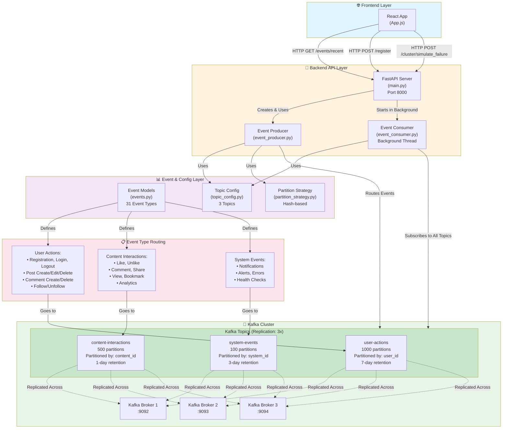
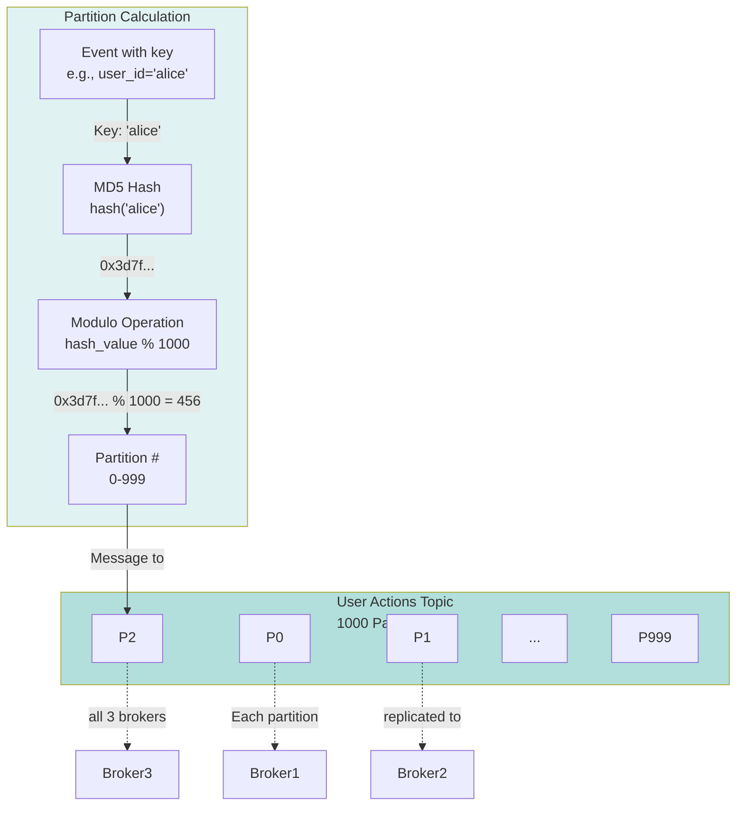
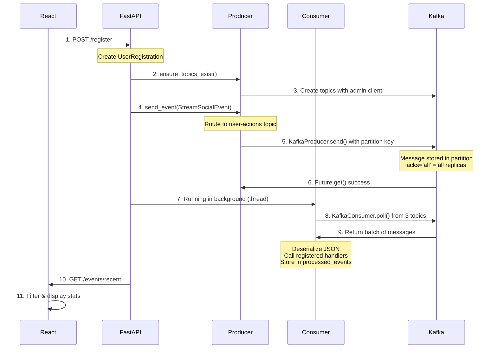
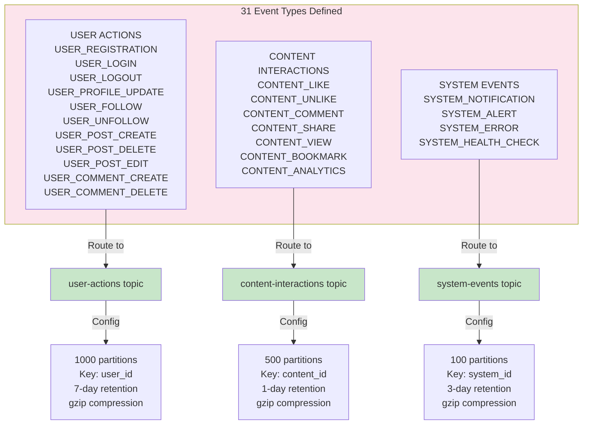

# StreamSocial Architecture Diagram

## System Architecture Overview



## Data Flow Diagram

```mermaid
graph LR
    User["👤 User Action"]
    
    subgraph HTTPFlow["HTTP Request Flow"]
        FE["Frontend<br/>sends HTTP"]
        API["FastAPI Endpoint<br/>receives request"]
        Validate["Validate & Create<br/>StreamSocialEvent"]
        Route["Route to Topic<br/>based on EventType"]
    end
    
    subgraph ProducerFlow["Producer Flow"]
        Extract["Extract Partition Key<br/>user_id/content_id/system_id"]
        Hash["Hash Key<br/>consistent hashing"]
        Calc["Calculate Partition<br/>hash % num_partitions"]
        Send["Send to Kafka<br/>with acks='all'"]
    end
    
    subgraph ConsumerFlow["Consumer Flow"]
        Sub["Consumer Subscribes<br/>to 3 Topics"]
        Listen["Listen for Events<br/>in Background Thread"]
        Process["Process Events<br/>by Registered Handlers"]
        Store["Store in<br/>processed_events"]
    end
    
    User -->|1. User clicks/submits| FE
    FE -->|2. POST/GET| API
    API -->|3. Parse Request| Validate
    Validate -->|4. Determine Topic| Route
    Route -->|5. User Action Events| Extract
    Extract -->|6. e.g., 'user_123'| Hash
    Hash -->|7. compute hash| Calc
    Calc -->|8. hash % 1000| Send
    Send -->|9. To Broker| Sub
    Sub -->|10. Messages arrive| Listen
    Listen -->|11. Deserialize JSON| Process
    Process -->|12. Call handlers| Store
    
    style HTTPFlow fill:#fff9c4
    style ProducerFlow fill:#c8e6c9
    style ConsumerFlow fill:#bbdefb
```



## Topic Partitioning Strategy



## Component Interactions



## Configuration & Event Routing



## Broker Cluster Replication

```mermaid
graph TB
    subgraph Cluster["Kafka Cluster - Replication Factor 3"]
        B1["Broker 1<br/>localhost:9092"]
        B2["Broker 2<br/>localhost:9093"]
        B3["Broker 3<br/>localhost:9094"]
    end
    
    subgraph Partitions["Each Topic"]
        P0["Partition 0"]
        P1["Partition 1"]
        Pn["Partition N"]
    end
    
    P0 -->|Leader| B1
    P0 -->|Replica| B2
    P0 -->|Replica| B3
    
    P1 -->|Replica| B1
    P1 -->|Leader| B2
    P1 -->|Replica| B3
    
    Pn -->|Replica| B1
    Pn -->|Replica| B2
    Pn -->|Leader| B3
    
    Note over Cluster: Each partition has 1 leader + 2 replicas<br/>Producer sends to leader<br/>Leader replicates to followers<br/>acks='all' waits for all replicas
    
    style Cluster fill:#e8f5e9
    style Partitions fill:#c8e6c9
```

---

## Key Concepts

### Producer Flow
1. **Receive Event**: FastAPI endpoint receives HTTP request
2. **Create Event Object**: Instantiate `StreamSocialEvent` with event type
3. **Route to Topic**: Event type determines target topic (user-actions, content-interactions, system-events)
4. **Extract Partition Key**: Get `user_id`, `content_id`, or `system_id` from event
5. **Calculate Partition**: Hash the key and mod by partition count
6. **Send to Broker**: KafkaProducer sends with `acks='all'` (waits for all replicas)

### Consumer Flow
1. **Subscribe**: Consumer subscribes to all 3 topics
2. **Poll**: Background thread continuously polls for new messages
3. **Deserialize**: JSON messages converted to Python dicts
4. **Handle**: Call registered handler functions
5. **Store**: Add to `processed_events` list for API queries

### Topic Strategy
- **user-actions** (1000 partitions): High-volume user events, ordered by user
- **content-interactions** (500 partitions): Ultra-high-volume content events, ordered by content
- **system-events** (100 partitions): Low-volume system notifications

### Replication
- **Factor**: 3 (each message replicated across all 3 brokers)
- **Durability**: `acks='all'` ensures all replicas acknowledge before success
- **Fault Tolerance**: Can lose up to 2 brokers without data loss
