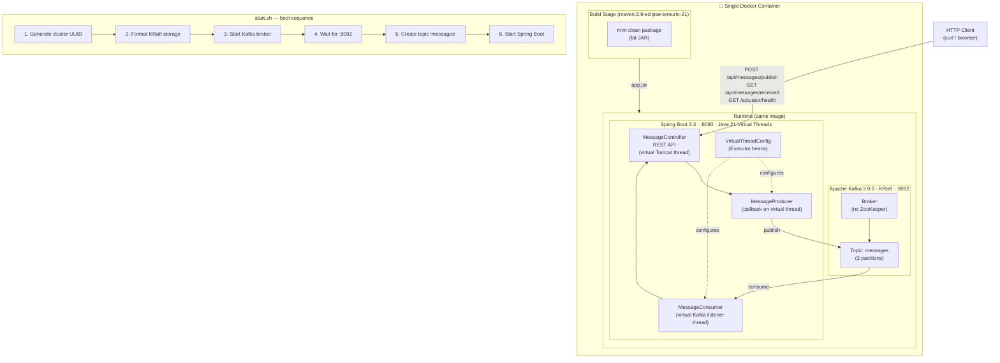
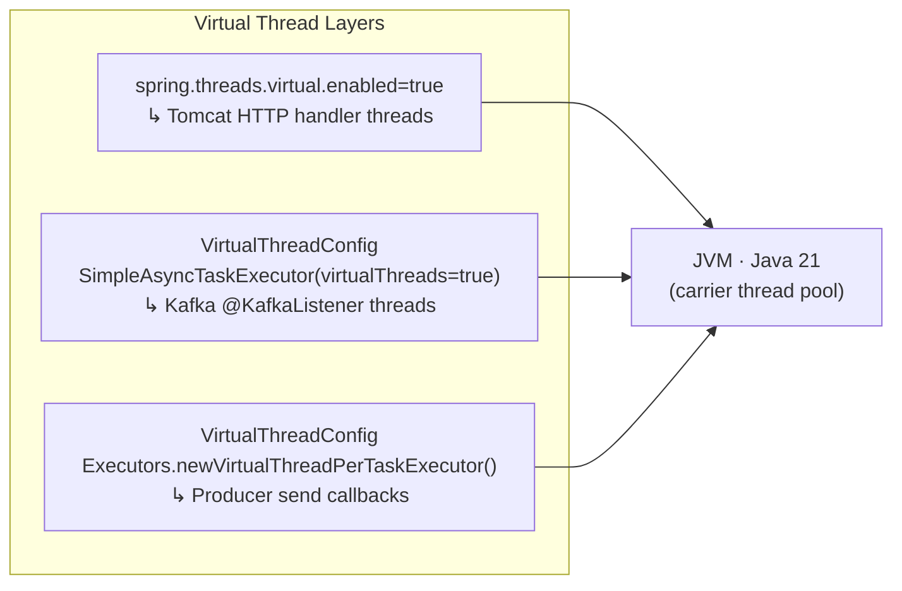
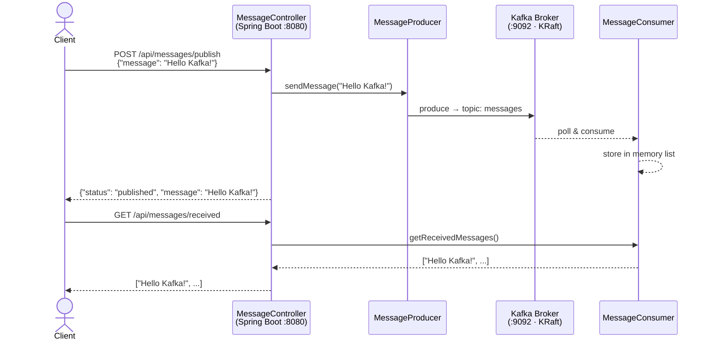
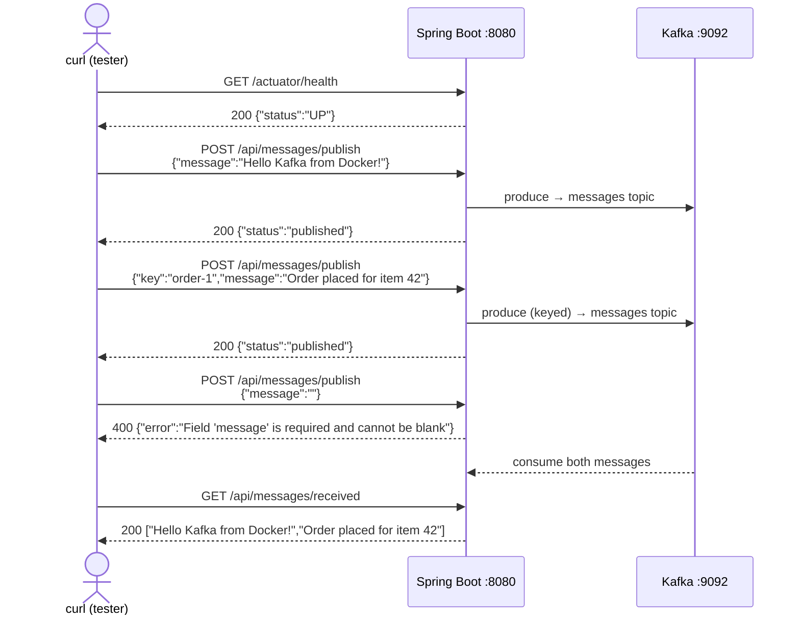

# Kafka Project — Spring Boot + Apache Kafka (KRaft)

A plug-and-play single Docker container that bundles:

- **Apache Kafka 3.9.0** running in **KRaft mode** (no ZooKeeper)
- **Spring Boot 3.3** REST application for publishing and consuming Kafka messages

---

## Quick Start

### Option A — Docker Compose (recommended)

```bash
docker compose up --build
```

### Option B — Plain Docker

```bash
# Build
docker build -t kafka-spring-app .

# Run
docker run -p 8080:8080 -p 9092:9092 kafka-spring-app
```

The container is healthy once both Kafka and the Spring Boot app are ready (allow ~60–90 seconds on first run).

---

## REST API

### Publish a message

```bash
curl -X POST http://localhost:8080/api/messages/publish \
     -H "Content-Type: application/json" \
     -d '{"message": "Hello Kafka!"}'
```

Publish with an explicit partition key:

```bash
curl -X POST http://localhost:8080/api/messages/publish \
     -H "Content-Type: application/json" \
     -d '{"key": "order-1", "message": "Order placed"}'
```

### Retrieve consumed messages

```bash
curl http://localhost:8080/api/messages/received
```

### Health check

```bash
curl http://localhost:8080/actuator/health
```

---

## Environment Variables

| Variable                  | Default       | Description                          |
|---------------------------|---------------|--------------------------------------|
| `KAFKA_BOOTSTRAP_SERVERS` | `localhost:9092` | Kafka bootstrap address           |
| `KAFKA_TOPIC_NAME`        | `messages`    | Topic used for publish / consume     |

---

## Architecture



### Virtual threads

All async layers run on **Java 21 virtual threads** (Project Loom):



| Layer | Mechanism | Log thread name |
|---|---|---|
| Tomcat HTTP | `spring.threads.virtual.enabled: true` | `omcat-handler-N` |
| Kafka listeners | `SimpleAsyncTaskExecutor(virtualThreads=true)` | `kafka-vt-listener-N` |
| Producer callbacks | `whenCompleteAsync(..., virtualThreadExecutor)` | `virtual-N` |

### Message flow



## Test Results

All tests were run against the live container on **2026-04-23** after building with the single-stage Dockerfile (no Java/Maven required on the host).

> **Update 2026-04-23:** Virtual threads enabled across all async layers (see [Virtual threads](#virtual-threads) section). Re-tested after rebuild — all tests still pass and virtual thread log output confirmed.

### Build

```mermaid
flowchart LR
    A["docker compose up --build"] --> B["Pull maven:3.9-eclipse-temurin-21"]
    B --> C["apt-get: wget · netcat · ca-certs"]
    C --> D["Download Kafka 3.9.0 tgz"]
    D --> E["mvn dependency:go-offline"]
    E --> F["mvn clean package -DskipTests"]
    F --> G["Image ready ✅"]
    G --> H["Container starts"]
    H --> I["Kafka KRaft broker up ✅"]
    I --> J["Topic 'messages' created ✅"]
    J --> K["Spring Boot started on :8080 ✅"]
```



### Endpoint tests

| # | Method | Endpoint | Request body | Expected | Actual | Pass |
|---|--------|----------|-------------|----------|--------|------|
| 1 | `GET` | `/actuator/health` | — | `{"status":"UP"}` | `{"status":"UP"}` | ✅ |
| 2 | `POST` | `/api/messages/publish` | `{"message":"Hello Kafka from Docker!"}` | `{"status":"published"}` | `{"status":"published","message":"Hello Kafka from Docker!"}` | ✅ |
| 3 | `POST` | `/api/messages/publish` | `{"key":"order-1","message":"Order placed for item 42"}` | `{"status":"published"}` | `{"status":"published","message":"Order placed for item 42"}` | ✅ |
| 4 | `POST` | `/api/messages/publish` | `{"message":""}` (blank) | `400` + error body | `{"error":"Field 'message' is required and cannot be blank"}` | ✅ |
| 5 | `GET` | `/api/messages/received` | — | Both messages in list | `["Hello Kafka from Docker!","Order placed for item 42"]` | ✅ |

### End-to-end flow (test run)



### Virtual threads test

Published a message after enabling virtual threads and inspected container logs:

```
# Request
curl -X POST http://localhost:8080/api/messages/publish \
     -H "Content-Type: application/json" \
     -d '{"message":"virtual thread test"}'

# Response
{"status":"published","message":"virtual thread test"}
```

**Log output confirming virtual threads on all layers:**

```
INFO  [kafka-project] [           main] c.c.kafka.config.VirtualThreadConfig
  : Kafka listener container factory configured with virtual-thread executor

INFO  [kafka-project] [     virtual-47] c.course.kafka.producer.MessageProducer
  : [virtual] Message published: 'virtual thread test' | topic='messages' partition=2 offset=0

INFO  [kafka-project] [a-vt-listener-1] c.course.kafka.consumer.MessageConsumer
  : [virtual] Message consumed on thread 'kafka-vt-listener-1': 'virtual thread test'
```

| Layer | Thread name in log | Virtual? |
|---|---|---|
| Producer send callback | `virtual-47` | ✅ `[virtual]` |
| Kafka consumer listener | `kafka-vt-listener-1` | ✅ `[virtual]` |
| Tomcat HTTP handler | `omcat-handler-0` | ✅ (via `spring.threads.virtual.enabled`) |

---

## Project Structure

```
.
├── Dockerfile                        # Single-stage build (JDK + Maven + Kafka + Spring Boot)
├── docker-compose.yml                # Compose shortcut
├── start.sh                          # Container entrypoint
├── pom.xml                           # Maven project
├── config/
│   └── kraft/
│       └── server.properties         # Kafka KRaft config
└── src/main/java/com/course/kafka/
    ├── KafkaProjectApplication.java
    ├── config/
    │   ├── KafkaTopicConfig.java       # Auto-creates the topic
    │   └── VirtualThreadConfig.java    # Java 21 virtual thread executor beans
    ├── producer/
    │   └── MessageProducer.java
    ├── consumer/
    │   └── MessageConsumer.java
    └── controller/
        └── MessageController.java
```
